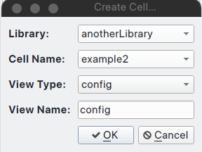
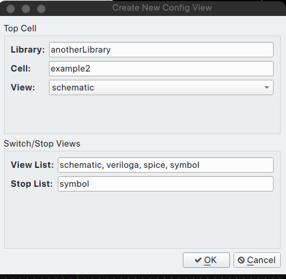
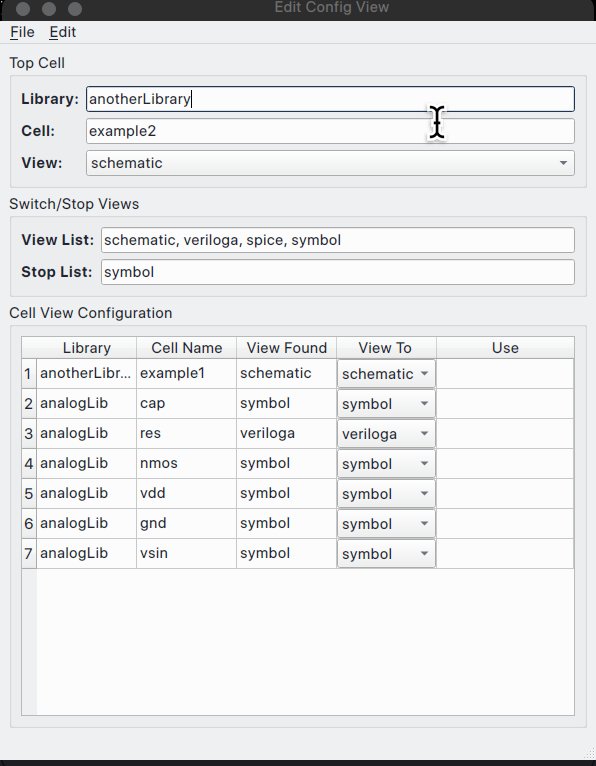
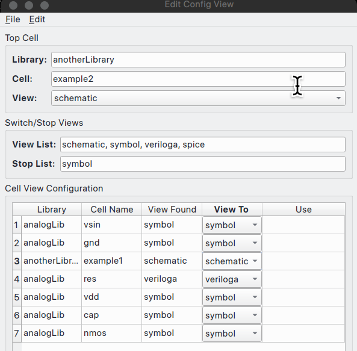
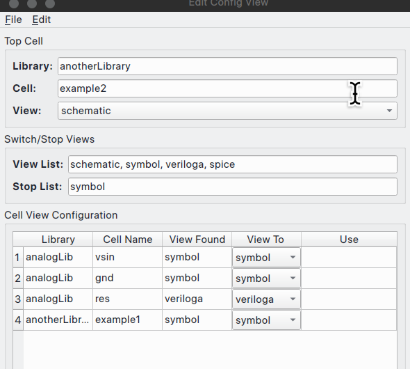

# Revolution EA Config Editor

Revolution EDA also offers the ability to create a *config* view to control the netlisting
process. Using a config view, the designer can decide which view will be used in the netlist
process, e.g. schematic, veriloga, spice or symbol. Over time other hardware description
languages will be also incorporated.

Config view is created like any other cell view. Just start the `Create Cell View` dialogue as
discussed above and selected `config` as view type and enter a view name that has *config*
string in it.



A new dialogue will be displayed for the config view specific information. It will ask which
cell view *config* view will be based on and the default preference order of the cellviews for
netlisting, i.e. *view list* field in *Switch/Stop Views* box. The dialogue has already default
values displayed under the **View Found** column. Under **View To** column, a combo box can be used to change the cellview to be used in the netlisting process.



After making desired changes in the dialogue, if any, the designer should press `OK` button.
Now, the *config view editor* window will be shown. At first, window will not have any fields
displayed. Under `File` menu, select `Update` menu item and the *Cell View Configuration* box
will display all the cells in the design and default view to use for netlisting.



There are two ways of changing the cellview to be used in the netlisting process:

1. The user can change the order cellviews in the **View List** field and select `File->Update` menu item. The cellview under the **View Found** column will change according to the precedence set by the order of the views in **View List** field.

2. 

3. For each cell, the user can select the cellview to be used for the netlisting. Note that changing a cellview with with hierarchy under it, will change the views shown in the config editor after triggering `Update` menu item.

In this example, let's choose `symbol` view for `example1` cell and trigger `Update`. Now, none of the cells under the `example1` cell `schematic` cellview show up because we chose `symbol` view. 




## Netlisting a circuit using Config View

Now, let us compare two different netlist created by two different config cellviews. In this case, where `schematic` view is used for `example1` cell versus `symbol` cellview is used for the same cell.
Save the *config* view above using `File` menu and `Save` option and open the *schematic* view (
It will be soon possible to netlist directly from config view editor.) Once again,
select `Create Netlist…` menu item under `Simulation` menu. The *Export Netlist* dialogue will
be displayed. Select `config` view instead of default `schematic` view and press OK. Make sure
that *Export Directory* is correct. The new netlist file will be created
with `<cellName>_<viewName>.cir` pattern:

```spice
**********************************************************************************
** Revolution EDA CDL Netlist
** Library: anotherLibrary
** Top Cell Name: example2
** View Name: schematic
** Date: 2024-03-16 23:04:24.408427
**********************************************************************************
*.GLOBAL gnd!

XI0 example1 net0 intNoe
XI1 example1 intNoe net1
Yres I4 net1 gnd!  resModel 1k
VI2 net0 gnd! PULSE( 1 1m 1k 0 0 0  )
.END
.MODEL resModel res R = 1
*.HDL /home/eskiyerli/OneDrive_reveda/Projects/RevEDA/exampleLibraries/analogLib/resVa/res.va
```

Note that netlister has not traversed down the example1 cell and used `veriloga` view for the resistor.
Now change the **View To** combobox for `example1` cell to `schematic` cellview and `res` cell to `symbol` cellview and save the config cellview. If the netlisting is redone using config view, the netlist will change following the template set in `config` cellview:

```spice
**********************************************************************************
** Revolution EDA CDL Netlist
** Library: anotherLibrary
** Top Cell Name: example2
** View Name: schematic
** Date: 2024-03-16 23:07:51.161492
**********************************************************************************
*.GLOBAL gnd!

XI0 example1 net0 intNoe
.SUBCKT example1 INP  OUT
RI1 net0 drain 1k
CI5 net0 drain 1p 0
CI8 OUT drain 1p 0
MI7 drain INP gnd! gnd! nmos w=2u l=0.18u nf=2  as=560n m=1
.ENDS
XI1 example1 intNoe net1
RI4 net1 gnd! 1k
VI2 net0 gnd! PULSE( 1 1m 1k 0 0 0  )
.END
```

In this case, `example` cell is traversed down to `schematic` view and that cellview is netlisted as subcircuit.

**Config Editor** offers a level of functionality that is still missing in some leading commercial EDA software.
