# Revolution EDA Integrated Circuit Symbol and Schematic Editors

[TOC]

==Revolution EDA symbol and schematic editors== are the new generation symbol and schematic editors that target the professional custom integrated circuit designers. It is open-/shared-source software that will form the basis of further development in multiple areas of design functions, such as:

1. Layout editing and automation
2. PDK development
3. Machine learning
4. Design Rule Check
5. Layout vs. Schematic Check
6. Parasitic extraction

## Advantages of Revolution EDA

Revolution EDA can

1. Create symbols with both symbol attributes that are common to all instances as well instance parameters. Instance parameters can be also python functions that allow the dynamic calculation of parameters for each instance.
2. Symbols can be created automatically from schematics and Verilog-a modules.
3. Verilog-a symbols have a clear separation between model and instance parameters.
4. File formats are JSON-based allowing easy inspection and editing with a text editor if needed. Using Git for version control will be soon integrated with library manager.
5. The netlisting process can be guided by a config view like commercial tools allowing designer to choose between different views for simulation.
6. Netlisting is currently geared towards Xyce circuit simulator but will be extended to Ngspice.

## Installation

There are a few different methods of installation depending on the user preference and experience.

### Cloning from Github RevEDA Release repository

Revolution EDA release repository is in GitHub and is regularly updated with the latest code. The released code is licensed with Mozilla Public License v2 modified with Commons Clause. This basically means that the users are able to use and modify the code as they wish but they cannot sell it. 

There are a few different methods to clone the repository:

1. Command line: `git clone https://github.com/eskiyerli/revedaRelease.git`

2. Using Github CLI: `gh repo clone eskiyerli/revedaRelease`

3. Using Github Desktop:  Under `File` menu, find clone `Clone Repository...` item and click. Choose `Github.com` tab and enter repository URL:  https://github.com/eskiyerli/revedaRelease
   
   

### Download a release from RevEDA Release repository

There are packages created with *pyinstaller* in RevEDA Release repository for both Linux and Windows OS. Head to `https://github.com/eskiyerli/revedaRelease/tags` and choose the latest release tag (currently at 0.4.1) and download and unzip the appropriate file for your operating system. For example, if you are using Linux:

```bash
unzip reveda_linux.zip
cd reveda
./reveda
```

should start the Revolution EDA editors.

### Download from PyPi Repository

Revolution EDA is also available as a downloadable package in PyPi repository. Just use `pip` command to download and install:

```bash
~> pip install revolution-eda
Defaulting to user installation because normal site-packages is not writeable
Collecting revolution-eda
  Downloading revolution_eda-0.4.1-py3-none-any.whl (134 kB)
     ━━━━━━━━━━━━━━━━━━━━━━━━━━━━━━━━━━━━━━━━ 134.3/134.3 kB 1.9 MB/s eta 0:00:00
Requirement already satisfied: quantiphy>=2.19 in /usr/lib/python3.10/site-packages (from revolution-eda) (2.19)
Requirement already satisfied: PySide6>=6.4.2 in /usr/lib/python3.10/site-packages (from revolution-eda) (6.4.2)
Requirement already satisfied: shiboken6==6.4.2 in /usr/lib/python3.10/site-packages (from PySide6>=6.4.2->revolution-eda) (6.4.2)
Installing collected packages: revolution-eda
Successfully installed revolution-eda-0.4.1
```

Then just start it `reveda` command.

## Revolution EDA Main Window

Revolution EDA window is the first window an user interacts. At the moment, `Tools` and `Options` menus are usable. Revolution EDA main window also includes a Python REPL interpreter. Python statements can be input at `>` prompt. Revolution EDA API is not yet stable but the user can still access all the power of a Python interpreter.

#### Tools Menu

`Tools` menu has currently two options: `Import -> Import Verilog-a file...` and `Library Browser`. 

A typical user will be regularly interacting with `Library Browser` to access design data files. Library Browser is used to create, open and delete libraries, create, copy and rename cells and cellviews. Note that Revolution EDA does not have a central database structure. Each library is in its folder and each cell is a sub-folder under the library folder. Each cellview is a file in the cell folder. Library folders are denoted by an empty `reveda.lib` file. 

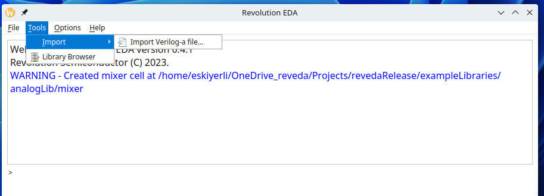

### Library Editor

Library editor should feel familiar to the experienced custom IC designers. It has only menu item: `Library`. Under this menu, all functions related to library, cell and cellviews are grouped. 

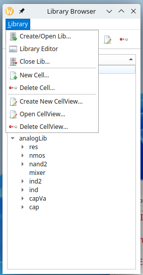

A library can be created using `Create/Open Lib...` dialogue, which will open a file browser. An existing library can be selected or a new folder can be created. Revolution EDA will create a `reveda.lib` file to denote that it is a valid library. At the moment, it is an empty file. 

`Library Editor` dialogue can be used to open existing design libraries as well as saving library paths in a `library.json` file so that the next time Revolution EDA is started the user will not have to open the libraries again.

`Close Lib` dialogue is used to close a design library.

`New Cell` dialogue creates an empty cell folder as well creating an item in the Library Browser. `Delete Cell` dialogue is used in turn to delete an existing cell. Note that when a cell is deleted, all the associated cell views are also deleted.

`Create New CellView...` dialogue is used to create a new cell view. The following cellviews are functional at the moment:

1. Schematic: to store circuit schematics
2. Symbol: to store circuit symbols
3. Verilog-a: to store information about the imported Verilog-a modules
4. Config: to store the control data to steer the circuit netlisting

Note that the name for any cellview should include cellview name. For example, `schematic123` or `Newschematic` are valid schematic cellview names but `schem` or `schem123ic` are not. 

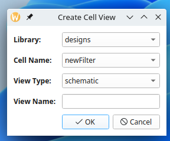

`Open CellView...` dialogue can be used to the relevant editor for a cellview.

| CellView  | Editor             | Note                                                          |
| --------- | ------------------ | ------------------------------------------------------------- |
| Schematic | Schematic Editor   |                                                               |
| Symbol    | Symbol Editor      |                                                               |
| Config    | Config view editor |                                                               |
| Verilog-a | Text Editor        | Set text editor path in `Options...` dialogue of main window. |

There are also contextual menus defined for library, cell and cellview items in the Library Browser. Selecting an item and clicking right mouse button will display the relevant menu:

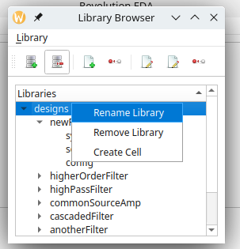

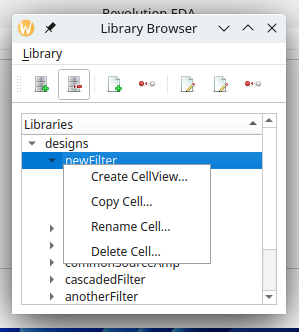

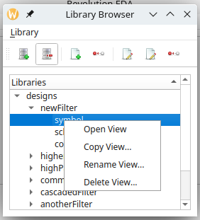

Their function are the same as the relevant menu item under `Library` menu.

## Symbol Editor

Symbol Editor is where the schematic representation of a basic circuit component, such as an inductor, capacitor or even an entire circuit can be created to be later used in the schematic editor.

Revolution EDA symbol editor is geared towards representation of integrated circuit components with complex geometry dependent parameters. Symbol editor has basic drawing functionality for

1. Lines
2. Circles
3. Arcs
4. Rectangles

Polyline functionality is not yet implemented. 

Edits can be undone or redone using `Undo` or `Redo` toolbar buttons, or `U` or `Shift-U` keys.

#### Lines

Lines are drawn by pointing-and-pressing left mouse button at the start and releasing at the end point of the line. Lines can be horizontal or vertical. A drawn line can be edited either by selecting it and pressing `q` key


 or by selecting `stretch` mode (`m`-key or selecting `stretch` option at the right-mouse button click). Then, select either end of the line, the line will turn red and selected line end will be indicated by a circle.


#### Circles

Circles are drawn by selecting a center point, pressing left-mouse button at that point and releasing left-mouse button. It can be also edited similarly to a line either by displaying the properties dialogue (select the circle and press `q` key or select the `Properties` option in the contextual menu),


or by pressing `m` key or selecting `stretch` option. The circle will turn red and a hand shape will denote that stretch mode is activated. Just move the hand-cursor so that the circle is the right size.


Beyond drawing a the symbol outline, the symbol editor can also indicate pins, where the element or the circuit is connected to the other elements or circuits. 

#### Rectangles

Rectangles are similarly created by pressing mouse button at one corner and then releasing it at the other diagonal corner.


Rectangles can be similarly edited using properties dialogues or stretching any side by selecting that side after pressing `m` key or selecting `stretch` option in the contextual menu.


#### Arcs

Arc drawing is performed similarly to a rectangle drawing. Depending on the angle of diagonal arc will be pointing any of the four directions:

| Diagonal Angle       | Arc Direction |
| -------------------- | ------------- |
| 90 > $\theta$ > 0    | Up            |
| 180 > $\theta$ > 90  | Left          |
| 270 > $\theta$ > 180 | Down          |
| 360 > $\theta$ > 270 | Right         |

Similarly to other shapes, arcs can be also be edited using property dialogue or by stretching. One caveat in stretching is that if the bounding rectangle of a stretched arc is flipped, it will be saved correctly in the cellview file. This is a known bug.


### Pins

Pins denote the connection of the element or circuit defined by symbol to the external circuits. Pins can be created by clicking toolbar icon or selecting `create Pin…` menu item under `Create` menu.  Note that pin direction and pin type information is not saved or used for the symbol cell views at the moment.


### Labels

Labels carry all the relevant information for an instance of a cellview. Thus the labels may different values (texts) for each instance. 

There are three types of labels:

1. **Normal**: These type of labels is just adding some notes on the text. They are not used in netlisting.

2. **NLPLabel**: These types of labels are evaluated using simple rules. Their format is:
   
   `[@propertyName:propertyName=%:propertyName=defaultValue]`
   
   The parts of the NLPLabel is separated by columns(:). Note that
   only **@propertyName** part is mandatory. The second and third parts
   do not need to exist in all NLPLabels.
   
   If only first part exists, there are a limited number of *predefined* labels that can be used.
   These are:
   
   | Label Name     | Label Definition | Explanation                                       |
   | -------------- | ---------------- | ------------------------------------------------- |
   | cell name      | `[@cellName]`    | Cell Name, e.g. nand2, nmos, etc                  |
   | instance name  | `[@instName]`    | Instance name for netlisting, e.g. I1, I15, etc.  |
   | library Name   | `[@libName]`     | Library Name for the symbol                       |
   | view Name      | `[@viewName]`    | View Name, normally includes *symbol* in the name |
   | element Number | `[@elementNum]`  | Element Number, forms a part of Instance Name     |
   | model Name     | `[@modelName]`   | Model name for the element in the netlist         |
   
   Model name label `[@modelName]` defaults to `modelName` entry in symbol attributes. 
   If the third part exists, the label text is determined by whether a label value is entered for the instance. If the label value is entered, then the second part is used to display the label, if not the third part is shown and used.

3. **Python Label** : Python labels allow the label values to be determined depending on the values of other labels or any other values defined in the process design kit (PDK). The ==relevant functions that can be used in the Python labels are defined in `PDK/callbacks.py` file==. Each symbol should have a class defined in `callbacks.py` file. A few sample definitions are shown in the included `PDK/callbacks.py` file:
   
   ```python
   from quantiphy import Quantity
   
   class baseInst():
       def __init__(self, labels_dict: dict):
           self._labelsDict = labels_dict
   
   class res(baseInst):
       def __init__(self,labels_dict:dict):
           super().__init__(labels_dict)
   
       def doubleR(self):
           Rvalue = self._labelsDict.get('R').labelValue
           if Rvalue.isalnum():
               return str(2*Quantity(Rvalue))
           return '?'
   
   class nmos(baseInst):
       def __init__(self,labels_dict:dict):
           super().__init__(labels_dict)
           self.w = Quantity(self._labelsDict['w'].labelValue)
           self.l = Quantity(self._labelsDict['l'].labelValue)
           self.nf= Quantity(self._labelsDict['nf'].labelValue)
           self.sd1p8v = 0.28
           self.sa1p8v = sb1p8v = 0.265
           self.sourceDiffs = lambda nf: int(int(nf) / 2 + 1)
   
       def asparm(self):
           return self.sourceDiffs(self.nf)*(self.w/self.nf)*self.sd1p8v
   ```
   
   For example, an `nmos` symbol has a `asparm()` function defined. We can use it to define the value of a label for `nmos` symbol. When this symbol is instantiated in a schematic, the value of `as` label will determined by `asparm()` function defined in the `callbacks.py` file. This means that instance callbacks can now use the all the facilities of Python, even conceivably ==machine learning== libraries to optimise designs.
   
   
   
   Labels can be also be hidden to reduce the clutter in the schematic instance of a symbol. Hidden labels are as valid as visible labels. Label properties dialogue also have `labelAlignment`, `labelOrientation` and `labelUse` fields, which are currently not implemented. However, labels can be rotated using context menu’s `rotate` option.

### Attributes

Attributes are properties that are common to all instances of a symbol. They could denote for example, how a particular symbol would be netlisted in Xyce circuit simulator netlist using `XyceNetlistLine` attribute. NLPDeviceFormat is originaly used by Glade by Peardrop Design Systems. It consists of string constants and NLP Expressions. 

When writing`XyceNetlistLine`, the labels should be directly copied from their definitions without any alterations. `[@pinList]` field is for pin names of the symbol. Note that order of pin names in this field will be determined by `pinOrder` attribute. `pinOrder` attribute should have a list of pins separated by comman. It is especially important to keep the pin order of a symbol consistent with, for example, `veriloga` module pin order. Similarly, device models require a particular order of pins in the device netlist line. For example, MOSFET devices will have `D, G, B, S` `pinOrder` attribute.

```
M[@elementNum] [@pinList] [@modelName] [@w:w=%u:w=2.0u] [@l:l=%u:l=0.13u] [@m:m=%]
```

Similarly, `[@modelName]` label will take its value from `modelName` attribute. 

Attributes are defined in the `Cellview properties` dialogue that can be accessed under `Edit` menu:


This dialogue has two parts.

The first part summarizes the already defined labels. Label properties can be changed also here. However labels can be deleted or added here. The second part is the `Symbol attributes` part. In this dialogue, any number of symbol attributes can be defined. These attributes will not be shown but can also be inspected but not edited in the schematic view.

### Other Editing functions

Any item on the symbol editor can be ==rotated, moved or copied== using by selecting menu item or by clicking on the relevant button on the toolbar as well as using context menu.

The cursor position is displayed at left-bottom corner of the editor. If the user wants to move the origin point of the symbol editor, it can use `Move Origin` menu item under `Edit` menu. Once it is selected, click at the new origin point. Hereafter, all the editing functions will refer to the new origin point.

## Schematic Editor

Schematic editor is used to instantiate symbol and define the nets that connect them.. The schematic editor is where the circuit design process begins. The schematic editor window is very similar to symbol editor window:

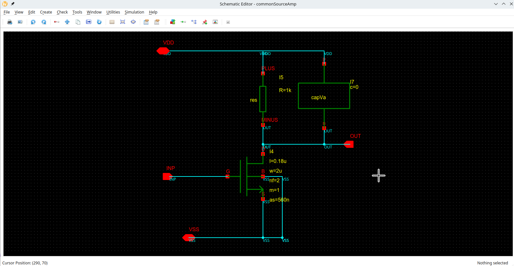

Main functions of the schematic editor are:

1. Instantiate symbols on schematic.
2. Define the instance properties.
3. Draw the nets that connect instances
4. Define pins that connect that the circuit to other circuits.
5. If pins are defined, use them to create a symbol to define another level of design hierarchy.
6. Netlist circuit using either *switchViewList* property or *config* view.

### Symbol Instantiation

A symbol to be placed on the schematic editor is selected by first pressing `i` key or selecting relevant menu item or toolbar button. A symbol selection dialogue is displayed.


Symbol selection dialogue only displays the symbol views. Choose the desired symbol and click `OK` button and click anywhere on the symbol editor window. The symbol will placed at that point. Note that `[@instName]` label will be converted to an instance name that starts with **I** and ends with a unique number. If any of other *NLPLabel*s have a default definition, they will be used. For NLPLabels without a default definition and *PyLabel*s only the definition of the label will be shown.

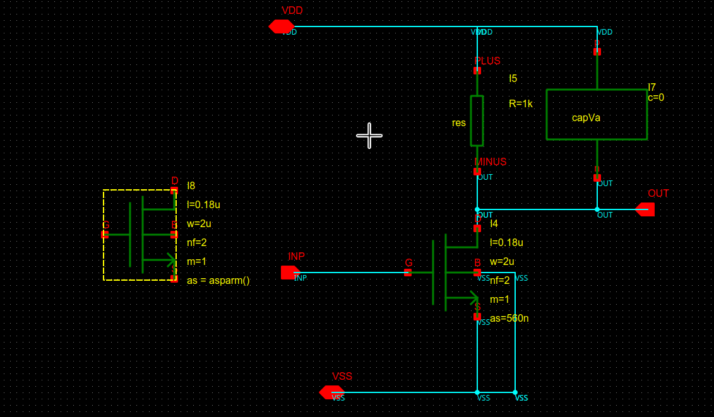

Now the select the instance and press `q` button to display ==instance properties== dialogue. Note that `as` parameter has ? shown for its value. Because it is defined as PyLabel in the symbol, once the values for other labels, e.g. *w*, *l*, *nf* and *m* are defined, its value will be calculated according to the formula defined in `callbacks.py` file.

Note that symbol attributes are also shown under *Instance Attributes* heading. However, the user cannot edit them using this dialogue, it is just there to inform the designer.


At the moment, only instance name, location and angle can be changed as well as instance label values.

### Creating Wires

Wires are used to make connections between instances at pins. A wire can be created by pressing `w` key or selecting `Create Wire` menu item under `Create` menu or by clicking toolbar button.

Wire starts at first point the left mouse button is clicked and ends at where it is released. For each net, a net name can be defined using `Net Properties` dialogue. This name will also propagate all other wires that wire touches. 

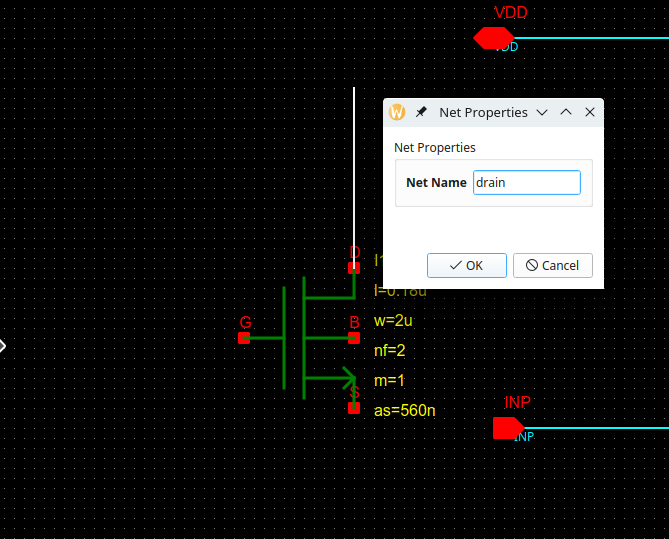

If a wire is extended by drawing another wire along its direction, i.e. horizontal or vertical, those wires will be merged and will become a single wire. If two wires are connected such that one wire is orthogonal to the other and connects at a mid-point, a solder-dot will be placed. Solder dot algorithm is not perfect and occasionally will not remove the solder dot even the original net is removed. It will be removed after a netlisting of the circuit. Solder-dots are ornaments and do not have any bearing on the netlisting process.

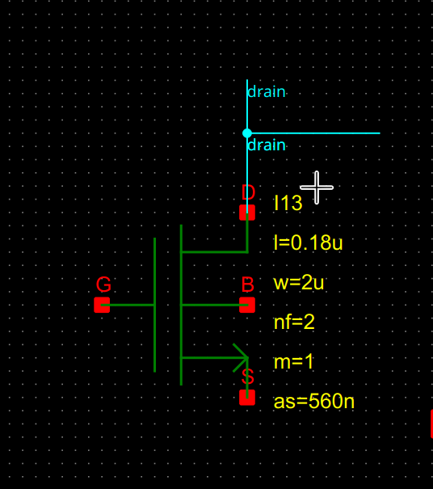

### Creating Pins

Like symbol pins, schematic pins define the connection points for the circuit in a hierarchical design. A pin can be created by pressing `p` key or selecting relevant menu item or toolbar button. Pins can have three directions:

1. Input
2. Output
3. InOut

At the moment, *Pin Type* definition is not used.


### Creating Text

Texts can be placed on the schematics. All monospaced fonts on the system can be used. However the Qt will try to find the closest font if it can find the exact font when the schematic were to be used in another system. 

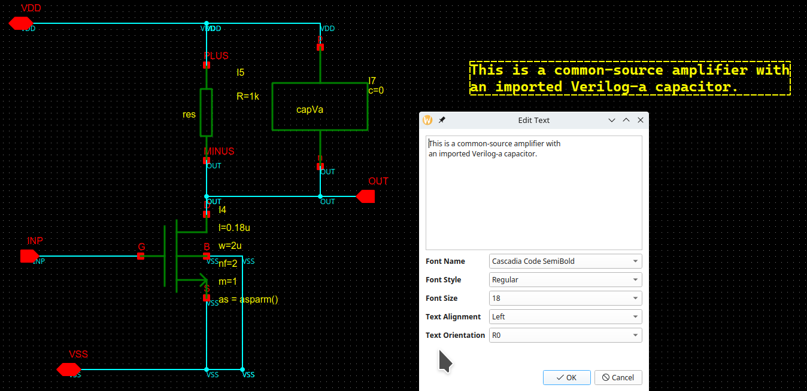

### Creating Symbols

A symbol for a schematic can be created automatically using `Create Symbol` menu item. Revolution EDA first verify the name of the symbol cell view. As explained earlier,  the cell view name should include *symbol* in the text.

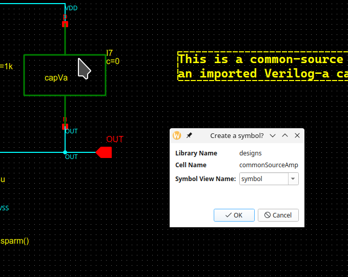

Once the symbol view name is entered, click `OK`. If a view with the same name exists, the Revolution EDA will confirm the designer wants to overwrite that view. If the input to that dialogue is also `OK`,  a new dialogue will be displayed:


The initial placement of pins is according to their directions. The designer is free to change the location of pins. It is advisable to keep *Stub Length* and *Pin spacing* values to keep a consistent look. Once the designer is satisfied the pin locations and symbol geometry parameters, he/she can proceed to creating a symbol view. The symbol view will be opened in another window. A library browser will also show a symbol view is added to the relevant cell.

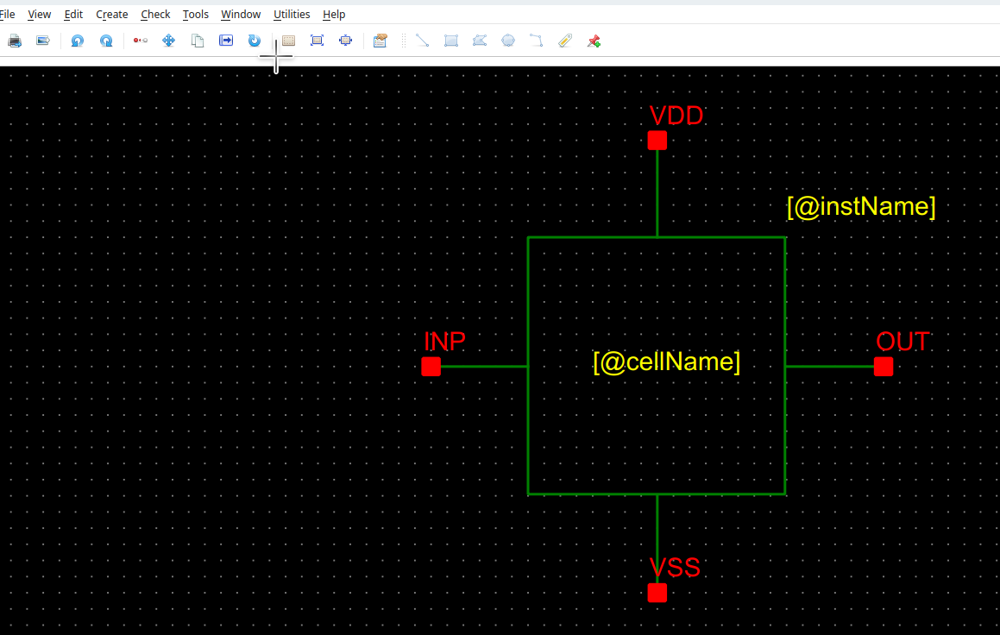

The symbol is now ready to use where *NLPDeviceFormat* is also defined for netlisting.

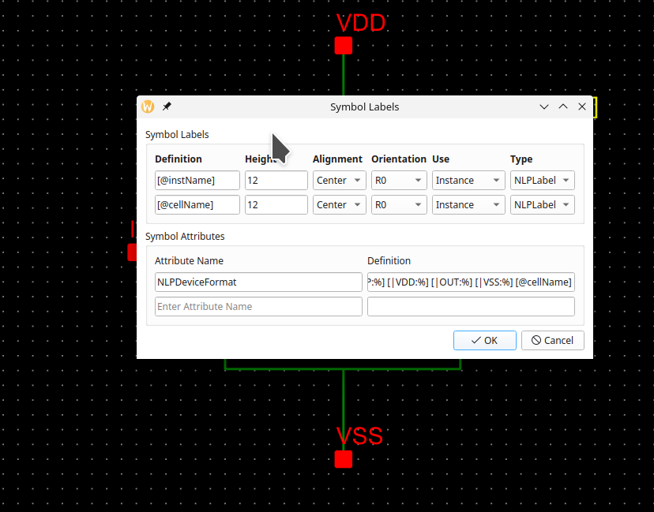

### Creating Netlists

Netlist creation can be done through `Simulation` menu and `Create Netlist` menu item. It will start an `Export Netlist` dialog.  Depending on the availability of *schematic* and *config* views, there could be more than one option to choose for `view` combobox. Here we will be concentrating on using *Switch view list* field to control the netlisting process. Once we explain the *config* view and the associated editor, we will also touch use of config views in netlisting process.


In this dialogue, the view to be netlisted is *schematic*. Switch view list is the order of preference in netlisting a cell. If a cell has both veriloga and schematic views, *schematic* view will be preferred and *veriloga* will not be used. Note that *spice* view is not yet implemented, but will be available soon.

*Export directory* field determines the parent folder name for the simulations. It is normally entered at *Options* menu of main window. 

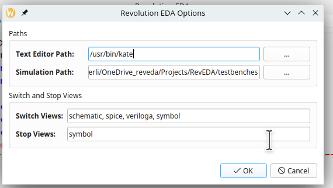

However it could be changed at *export netlist* field as well. However, it ==will not be saved== in the Revolution EDA configuration file unlike the entries in *Options* dialogue.

When `OK` button is clicked,Revolution EDA will do a full hierarchical netlisting of the circuit. The circuit netlist will be placed under `SimulationPath/cellName` directory. The netlist file name will be `celllName_viewName.cir` where `cellName` and `viewName` will be the cell name and view name of the netlisted circuit. The circuit netlist in this case is:

```verilog
********************************************************************************
* Revolution EDA CDL Netlist
* Library: designs
* Top Cell Name: newFilter
* View Name: schematic
* Date: 2023-02-15 19:44:01.772828
********************************************************************************
.GLOBAL gnd!

Ycapacitor I1 OUT VSS! capacitorModel c=0
.MODEL capacitorModel capacitor c = 0
XI4 INP net0 VSS! highPassFilter
.SUBCKT highPassFilter INP OUT VSS
RI2 OUT INP R=1k
CI4 OUT VSS C=1p
.ENDS
XI1 net0 OUT VSS! highPassFilter
.END
```

## Config Editor

Revolution EDA also offers the ability to create a *config* view to control the netlisting process. Using a config view, the designer can decide which view will be used in the netlist process, e.g. schematic, veriloga or (soon) spice. Over time other hardware description languages will be also incorporated. 

Config view is created like any other cell view. Just start the `Create Cell View` dialogue as discussed above and selected `config` as view type and enter a view name that has *config* string in it.


A new dialogue will be displayed for the config view specific information.  It will ask which cell view *config* view will be based on and the default preference order of the cellviews for netlisting, i.e. *view list* field in *Switch/Stop Views* box. The dialogue has already default values displayed. 


After making desired changes in the dialogue, if any, the designer should press `OK` button. Now, the *config view editor* window will be shown.  At first, window will not have any fields displayed. Under `File` menu, select `Update` menu item and the *Cell View Configuration* box will display all the cells in the design and default view to use for netlisting.

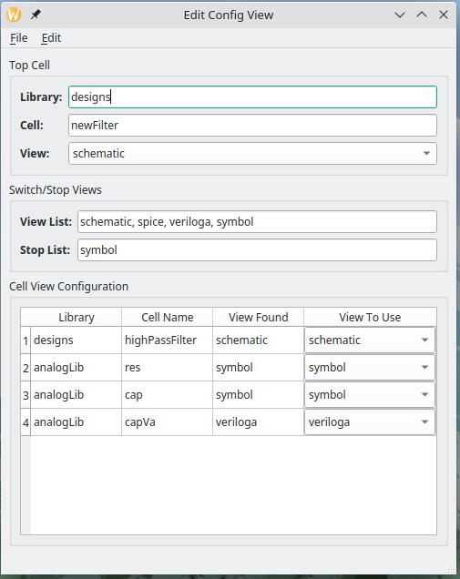

The combo box under *View to Use* heading for each cell in the circuit can be used to select the view to use for netlist. This is a fairly simple circuit, but let’s select *symbol* view for *highPassFilter* cell. This means that the netlister will stop at *symbol* view and will not go down the hierarchy. Once again, select `Update` menu item under `File` menu. The updated config view will now show only *highPassFilter* and *capVa* cells.

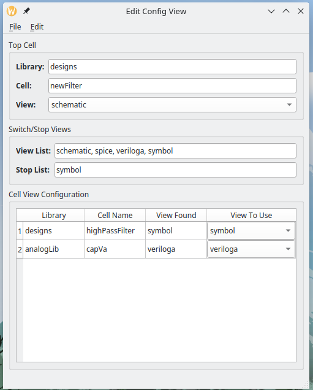

### Netlisting a circuit using Config View

Save the *config* view above using `File` menu and `Save` option and open the *schematic* view (It will be soon possible to netlist directly from config view editor.) Once again, select `Create Netlist…` menu item under `Simulation` menu. The *Export Netlist* dialogue will be displayed. Select `config` view instead of default `schematic` view and press OK. Make sure that *Export Directory* is correct. The new netlist file will be created with `<cellName>_<viewName>.cir` pattern.

```
********************************************************************************
* Revolution EDA CDL Netlist
* Library: designs
* Top Cell Name: newFilter
* View Name: schematic
* Date: 2023-02-16 11:10:12.537916
********************************************************************************
.GLOBAL gnd!

XI4  INP VSS! net0 highPassFilter
XI1  net0 VSS! OUT highPassFilter
Ycapacitor I1 OUT VSS!  capacitorModel c=0
.END
```

Compare this to to the netlist for schematic view. The netlister has not proceeded into the schematic view for *highPassFilter* cell.

```
********************************************************************************
* Revolution EDA CDL Netlist
* Library: designs
* Top Cell Name: newFilter
* View Name: schematic
* Date: 2023-02-16 11:09:45.560264
********************************************************************************
.GLOBAL gnd!

XI4 INP net0 VSS! highPassFilter
.SUBCKT highPassFilter INP OUT VSS
CI4 OUT VSS C=1p
RI2 OUT INP R=1k
.ENDS
XI1 net0 OUT VSS! highPassFilter
Ycapacitor I1 OUT VSS!  capacitorModel c=0
.END
```

Config view is a new feature for Revolution EDA which has not been extensively tested. Introduction of more cell views for circuit simulation will further increase the value of this feature.

## Importing of Verilog-A modules

Verilog-A is frequently used hardware description language (HDL) for analogue circuits. Revolution EDA can import Verilog-A modules to be used in the netlisting. The netlisting process is currently following Xyce conventions. Ngspice 39 includes OSDI interface for device models. OpenVAF is able to create OSDI compliant modules from Verilog-a files. We will be soon introducing that the possibility creating of ngspice/OpenVAF compatible netlists.

Verilog-a file to be imported should only have one verilog-a module. To start the import procedure, select `Tools` menu, `Import` submenu and then `Import Verilog-a file…` menu item. The following dialogue will be displayed:

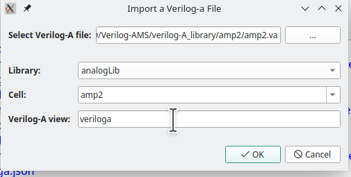

*Select Verilog-A file* field is for selection of Verilog-A file to be imported. Once the file is selected, the library, cell name and veriloga view name should be entered. Note that cell name and view name fields are editable. Thus a new cell with a veriloga view can be created. Once `OK` button is clicked, *Create Symbol* dialogue will be displayed. In that dialogue, fill the pin location forms as needed to cover all the pins:

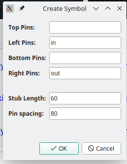

Once again, press `OK` button to see the created symbol in *Symbol Editor*. Symbol will have all the needed labels for correct netlisting. `[@vaFile]` and `[@vaModule]` labels will be hidden in the schematic. *Symbol labels* dialogue will also show the symbol labels and attributes. 

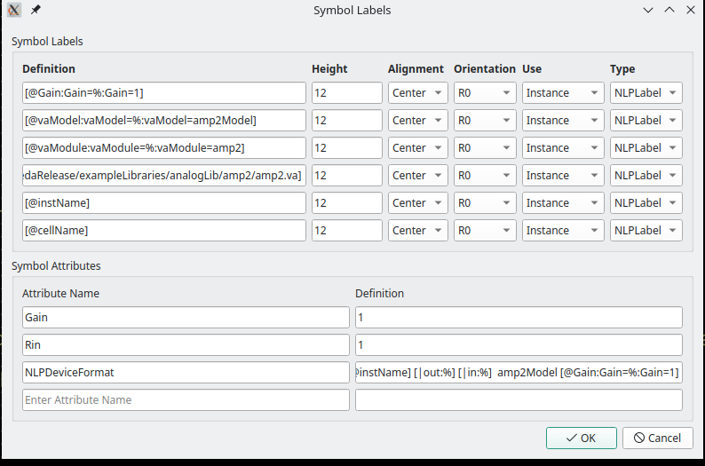

In the *Library Browser* window, the user will find two cell views under the selected cell name:

1. Symbol view
2. Veriloga view

If Veriloga view is selected and opened, the veriloga module will be opened with the text editor selected in `Options` menu of main window. Once the edits are done and editor window is closed, the verilog-a import dialogue will be displayed once more.

## Revolution EDA License Terms

Revolution EDA is licensed under [ Mozilla Public License 2.0](https://www.mozilla.org/en-US/MPL/2.0/ "Mozilla Public License 2.0") amended by [Commons Clause](https://commonsclause.com/ 'Commons Clause"'). This amendment makes the software licensed under a source availability type license. The user has all the rights granted under Mozilla Public License 2.0 except ability to ==sell== the software.
