# Revolution EDA Layout Editor

Layout editor is a recent addition to Revolution EDA and allows the basic editing functions necessary in the physical layout of custom integrated circuits. Currently, the layout editor can create:

1. Instances of other layouts on the current layout to create hierarchical layouts.
2. Rectangles on any layer
3. Wires
4. Pins including a pin rectangle and a label
5. Labels
6. Vias to connect two layers vertically
7. Polygons

Revolution EDA layout editor also allows use parametric layout cells to programmatically create layout instances of cells defined as `pcell` cellview.

There is a on-screen ruler that allows the measurement of dimensions of and distance between physical layout elements.

Layout Editor Window has two main areas below the menu and toolbar areas:

1. LSW (Layer Selection Window) on the left side where layer related information is presented in five columns:

   1. Layer Stipple: This is a sample of layer texture drawn in the layout editor. It can be created using the `Stipple Editor` accessible from `Tools` menu 
   2. Layer Name: Name of the layer. This usually corresponds to a particular GDS layer.
   3. Layer Purpose: Purpose of the layer, for example: drawing, pin, text, etc. This usually corresponds to a datatype in GDS output.
   4. Visibility: Whether a layer is visible. If the checkbox is checked the layer is visible.
   5. Selectable: Whether a layer is selectable. If the checkbox is checked the layer is selectable.

2. Layout Editor Scene: This is where the editing actions are performed.

   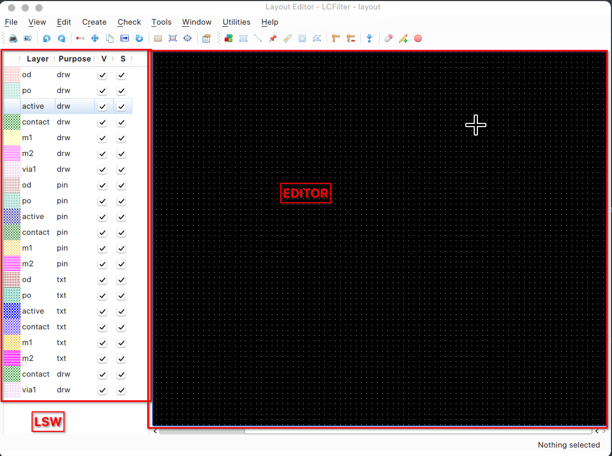


## PDK creation for Layout Editor

A process design kit for the physical layout of an integrated circuit requires extensive information. Among others, a PDK should include:

1. Layout layers information
2. Process information such as database units (dbu), via definitions, via layers, etc
3. Layout parametric cells
4. Layout design rules for Design Rules (DRC) checking.
5. Layout extraction rules for layout-versus-schematic checks (LVS).
6. Layout parasitics extraction, i.e. resistive, capacitive and inductive parasitic elements due to physical layout.  

At the moment, **Revolution EDA* only includes the infrastructure first three items. The DRC and LVS could be done on exported GDS netlists using either a commercial tool, or GDS editor such [kLayout](https://www.klayout.de 'kLayout') with DRC and LVS scripts for a particular technology.

Revolution EDA does not yet provide a commercial PDK. As the layout editor is still very new, its PDK format is subject to change. The PDK is currently structured in a few distinct files which are a part of `pdk` module.
PDK module folder should be named `pdk`. However this folder can be placed anywhere in the file system as its path is determined with `REVEDA_PDK_PATH` environment variable. If PDK administrator does not want to bother with setting the PDK paths in the user environment, a convenient mechanism using `.env` file at the root path of *Revolution EDA* executable is provided. For example, the example `.env` provided includes the following variables:

```bash
# development settings
#REVEDASIM_PATH = ./revedasim
REVEDAEDIT_PATH = ./revedaEditor
REVEDA_PDK_PATH = ./pdk
```

Note that `REVEDA_PDK_PATH` is set to `./pdk`. However, it could be well set to any other path. Thus, it is very easy to provide users with different PDK paths depending on the project.

The example `pdk` module is currently organised as below:

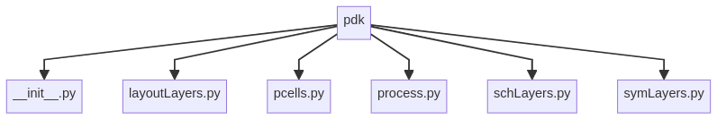

### LayoutLayers

This module includes the information on the layout layers. Each layout layer is defined as data class of Python. The layout layer data class is defined as:

```python
@dataclass
class layLayer:
    name: str = ""  # edLayer name
    purpose: str = "drawing"  # layout Layer purpose
    pcolor: QColor = Qt.black  # pen colour
    pwidth: int = 1  # pen width
    pstyle: Qt.PenStyle = Qt.SolidLine  # pen style
    bcolor: QColor = Qt.transparent  # brush colour
    btexture: str = ""  # brush texture
    z: int = 1  # z-index
    selectable: bool = True  # selectable
    visible: bool = True  # visible
    gdsLayer: int = 0  # gds edLayer
    datatype: int = 0  # gds datatype
```

Note that all the relevant information for a layer is collated in a single definition. A layout layer definition entry in `layoutLayers.py` module will look like this:

```python
odLayer_drw = ddef.layLayer(
    name="od",
    purpose="drw",
    pcolor=QColor(255, 0, 0, 127),
    pwidth=1,
    pstyle=Qt.SolidLine,
    bcolor=QColor(255, 0, 0, 127),
    btexture="pdk/stipple1.png",
    z=1,
    visible=True,
    selectable=True,
    gdsLayer=0,
)
```

- *name*: Name of the layer
- *purpose*: Purpose of the layer such as **drw**, **pin**, etc.
- *pcolor*: Colour of the layer expressed as Red, Green, Blue and Transparency levels.
- pwidth: Pen width
- pstyle: Pen style
- *bcolor*: Similarly colour ofbrush is defined by `bcolor` property.
- *btexture*: This property defines the texture of brush defined in a stipple png file. There is a separate stipple editor that can be accessed from the main Revolution EDA window using `Tools->Create Stipple…` menu item. 
- *z*: This property is used to give the vertical stacking order of the layers. It is not used at the moment.
- *visible*: Used to determine whether this layer is visible.
- *selectable*: Used to determine whether this layer is selectable.
- *gdsLayer*: GDS Layer number.

### Pcells

This file defines the parametric layout cells as Python classes. A sample NMOS parametric cell code is provided to guide PDK engineers in creating new parametric layout cells. Important point is that this class has a `__call__` dunder method defined that allows it to be called with a number of parameters like a function to update itself. When an instance of parametric layout cell is first initialized, there are no shapes associated with it. It needs to be called with proper parameters so that the layout instance is created. Everytime the parameters are changed, the instance shape will be recreated.

```python
from PySide6.QtCore import (
    QPoint,
)

import pdk.layoutLayers as laylyr
import pdk.process as fabproc
import revedaEditor.common.layoutShapes as lshp

class nmos(lshp.layoutPcell):
    cut = int(0.17 * fabproc.dbu)
    poly_to_cut = int(0.055 * fabproc.dbu)
    diff_ovlp_cut = int(0.06 * fabproc.dbu)
    poly_ovlp_diff = int(0.13 * fabproc.dbu)
    nsdm_ovlp_diff = int(0.12 * fabproc.dbu)
    li_ovlp_cut = int(0.06 * fabproc.dbu)
    sa = poly_to_cut + cut + diff_ovlp_cut
    sd = 2 * (max(poly_to_cut, diff_ovlp_cut)) + cut

    # when initialized it has no shapes.
    def __init__(
        self,
        width: str = 4.0,
        length: str = 0.13,
        nf: str = 1,
    ):
        self._shapes = []
        # define the device parameters here but set them to zero
        self._deviceWidth = float(width)  # device width
        self._drawnWidth: int = int(
            fabproc.dbu * self._deviceWidth
        )  # width in grid points
        self._deviceLength = float(length)  # gate length
        self._drawnLength: int = int(fabproc.dbu * self._deviceLength)
        self._nf = int(float(nf))  # number of fingers.
        self._widthPerFinger = int(self._drawnWidth / self._nf)
        super().__init__(self._shapes)

    #

    def __call__(self, width: float, length: float, nf: int):
        """
        When pcell instance is called, it removes all the shapes and recreates them and adds them as child items to pcell.
        """
        self._deviceWidth = float(width)  # total gate width
        self._drawnWidth = int(
            self._deviceWidth * fabproc.dbu
        )  # drawn gate width in grid points
        self._deviceLength = float(length)  # gate length
        self._drawnLength = int(
            self._deviceLength * fabproc.dbu
        )  # drawn gate length in grid points
        self._nf = int(float(nf))  # number of fingers
        self._widthPerFinger = self._drawnWidth / self._nf
        self.shapes = self.createGeometry()

    def createGeometry(self) -> list[lshp.layoutShape]:
        activeRect = lshp.layoutRect(
            QPoint(0, 0),
            QPoint(
                self._widthPerFinger,
                int(
                    self._nf * self._drawnLength
                    + 2 * nmos.sa
                    + (self._nf - 1) * nmos.sd
                ),
            ),
            laylyr.odLayer_drw,
        )
        polyFingers = [
            lshp.layoutRect(
                QPoint(
                    -nmos.poly_ovlp_diff,
                    nmos.sa + finger * (self._drawnLength + nmos.sd),
                ),
                QPoint(
                    self._widthPerFinger + nmos.poly_ovlp_diff,
                    nmos.sa
                    + finger * (self._drawnLength + nmos.sd)
                    + self._drawnLength,
                ),
                laylyr.poLayer_drw,
            )
            for finger in range(self._nf)
        ]
        # contacts = [lshp.layoutRect(

        # )]
        return [activeRect, *polyFingers]

    @property
    def width(self):
        return self._deviceWidth

    @width.setter
    def width(self, value: float):
        self._deviceWidth = value

    @property
    def length(self):
        return self._deviceLength

    @length.setter
    def length(self, value: float):
        self._deviceLength = value

    @property
    def nf(self):
        return self._nf

    @nf.setter
    def nf(self, value: int):
        self._nf = value
```

### Process

This module is used to define the parameters that will be used in the PDK definition. For example, *database units per micrometer (dbu)* or the via dimensions and layers, etc. 

### Schematic Layers

This module defines the layer properties used in the schematics such as wire, text, pin, etc. It has the same format as the layout properties module based on  `schLayer` dataclass.

### Symbol Layers

Similar to schematic or layout layers modules, this module describes the layer properties used for symbol drawing.

Revolution EDA’s PDK structure is still a work-in-progress and more modules might be added by the PDK developers as needed.

## Editing Functions

### Rectangles

A rectangle on any layer can be created by:

1. Selecting `Create->Rectangle` menu item,
2. Pressing `Create Rectangle` icon on the layout toolbar,
3. Finally, pressing `r` key

A rectangle will be created such that its diagonal will be between the first location the right mouse button is clicked and the second location the right mouse button is clicked. It is not necessary to hold right mouse button pressed. Rectangle will be created on the layer selected in the LSW.

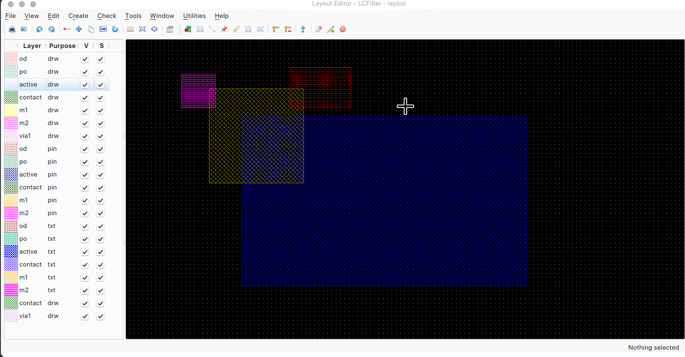

If the user wants to change any properties of a rectangle such as width, height, layer or top left point coordinates (in um), he or she needs to select the rectangle press `q` or  select `Edit->Properties->Object Properties` menu item. A dialogue will be shown:

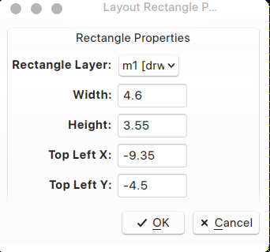

Any changes can be entered in the dialogue and once `OK` button is pressed these changes will be applied to the selected rectangle.

### Paths (Wires)

A wire path in Revolution EDA layout editor can be drawn using `Create-> Create Path..`menu item or `Create Path` toolbar button or simply pressing on `w` key on anywhere in the editor window. This will bring up the `Create Path`dialogue:

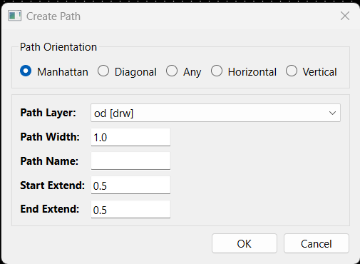

Paths can be only drawn on `drawing` layers as designated in `layoutLayer.py`module by `pdkDrawingLayers` list. 
There are in total six settings in `Create Path` dialogue.

1. Path Orientation: 
   1. *Manhattan*: Paths can be drawn in Manhattan orientation, i.e. 0, 90, 180 and 270 degree angles.
   2. *Diagonal*: Paths angles can be changed in 45 degree steps: 0, 45, 90...335 and 360 degree angles.
   3. *Any*: Paths can have any angle.
   4. Horizontal: Path angle can only 0 and 180 degree angles with respect to horizontal.
   5. Vertical: Path angle can only 90 and 270 degree angles with respect to horizontal.
2. Path Layer: As explained above any of the drawing layers can be used to draw paths. 
3. Path Width: Path width can be entered here, it defaults to 1um.
4. Start Extend: This field shows how much the path is extended behind the starting point, it defaults to 0.5 um.
5. End Extend: This field shows  how much the path is extended beyond the end point, it defaults to 0.5 um.

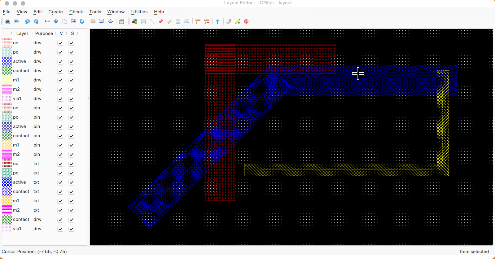

The properties of a path can also be changed after its drawn using `Path Properties Dialogue`. 

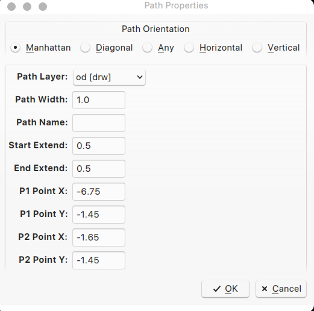

A path can also be edited using `Stretch` mode. Just select the layout path, click `s` key or select `Edit->Stretch` menu item and click on one of the end points of the path. The cursor will change to a double sided arrow cursor and now you can move your mouse to stretch the path. Once the path is stretched to the desired point, press `Esc` key to stop stretch action.

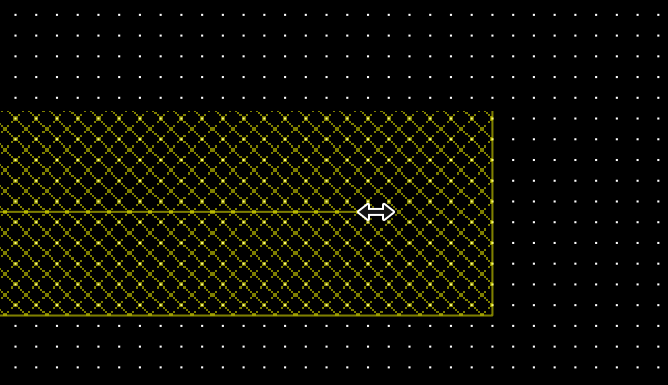

### Pins

In Revolution EDA, pins have two components:

1. The rectangle at which pin shape is defined. Normally it will be defined at a dedicated layer with `pin` purpose, but it does not have to.
2. The pin label, which defines the name of the pin.

Note that most LVS tools such as Calibre do only use label information and placement to define the pin locations.

To create a pin, press `p` key or select `Create->Create Pin…` menu item. Alternatively one could select the `Create Pin` button at the layout toolbar. A dialogue titled `Create Layout Pin` will be shown. In this dialogue,  all the related attributes of a layout pin can be defined such as pin name, direction, type, and layer, followed by label  properties such layer, font name, size, height, alignment and orientation. Pin layer and label layer will default to first members of `pdkPinLayers` and `pdkTextLayers` lists defined in `layoutLayers.py` module.

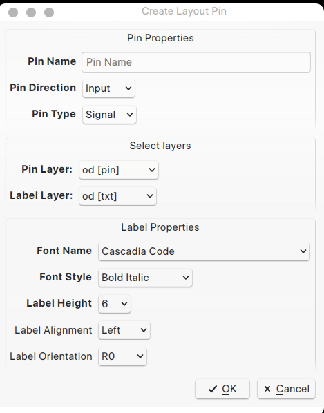

Enter the desired values for each property. Default values can be used except for pin name. Note that Revolution EDA will list all the monospaced fonts installed in the system. Whether these fonts are available between different operating systems must be determined beforehand. After entering the pin name, click `OK` button.

Now click right mouse button for the first point of the pin shape rectangle and then pull the mouse cursor while pressing right mouse button to the other end of rectangle diagonal and unpress the right mouse button to finish the editing the pin shape rectangle. Immediately, the pin name label will be shown at the cursor location. Press the mouse button once more in the pin shape rectangle to place pin label (name) and press `Esc` key to finish the edit.

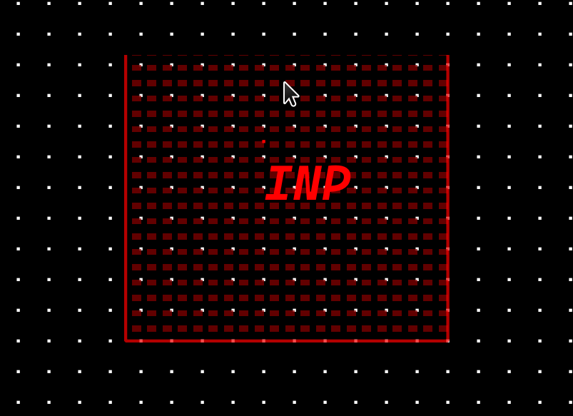


### Labels

Labels also can be created without using pin shape. Press `L` key or select `Create->Create Label...`or press `Create Label` button on layout toolbar.

In this dialogue, enter the label name and choose the label layer. The label layer combobox will list all the layers defined in `pdkTextLayers` layer list in the `layoutLayers.py` module. Once `OK` button is clicked, the label with the selected font will follow mouse cursor. Press right mouse button at the desired location. Note that labels are normally used by LVS tools such as Calibre to define the connectivity.

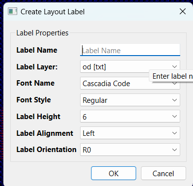

### Polygons

Polygons are any closed shape that can have number of corners or sides between three (3) and essentially infinite. A polygon is defined sequentially starting from the first corner and adding additional corners. After adding a corner, there will be a guide line drawn between the last point and where the cursor is on the screen:


If the right mouse button is clicked once more where the new corner of the polygon is desired to be placed, the polygon will be reshaped to include the new corner:

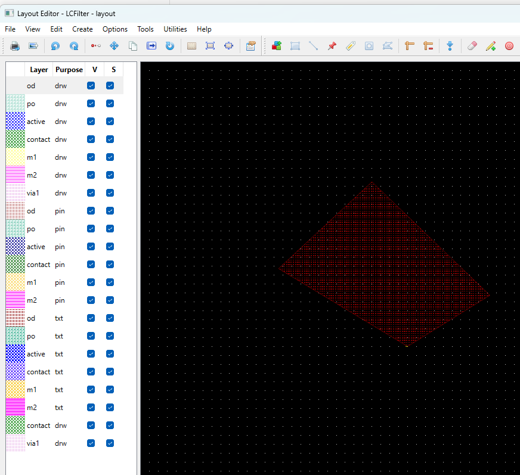

This process could be continued as many times as needed. Of course, a layout polygon can be edited after its drawn. Like a symbol polygon, a layout polygon can be *stretched* using `stretch` mode when it is selected by pressing `s` button or selecting relevant menu item or layout toolbar button. Then select one of the corners by pressing right mouse button. Move that corner to its new location while pressing right mouse button and release the button. Alternatively, you could edit the point locations using `Layout Polygon Properties` dialogue. Using this dialogue also allows changing the layer of the polygon.

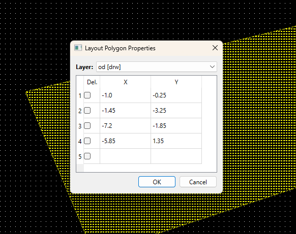 


### Rulers

In custom IC layout design editing, rulers are extensively used and thus Revolution EDA also offers the ruler addition. A ruler measures the length between two points on the layout. Layout rulers in Revolution EDA can be orthogonal but not yet diagonal. A ruler can be started by pressing `K`, pressing `Create->Add Ruler` menu item or `Add Ruler` button on layout toolbar.

Press right mouse button where you want to ruler to start from, release mouse button and then right click again on right mouse where you want ruler should measure to. To finish ruler addition, press `ESC` key or select another editing function. 

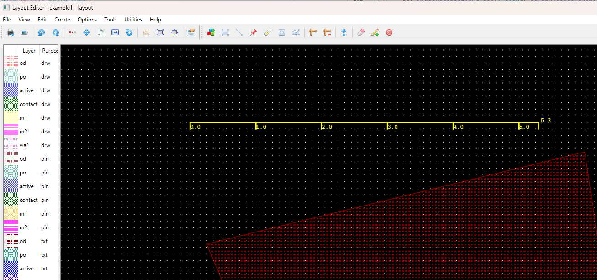

A ruler can be selected and moved or deleted. If you want to remove all the rulers on the layout, just press `Shift` and `K` keys simultaneously or select `Delete Rulers` menu item or layout toolbar button.

### Instantiating Layout Cells

By creating layout cells including other layout cells, rectangles, paths, pins, labels, polygons and parametric layout cells (pcells), a hierarchic layout design can be accomplished. A layout cell can be instantiated similar to a schematic cell either by pressing `I` key, or selecting `Create->Create Instance` menu item.

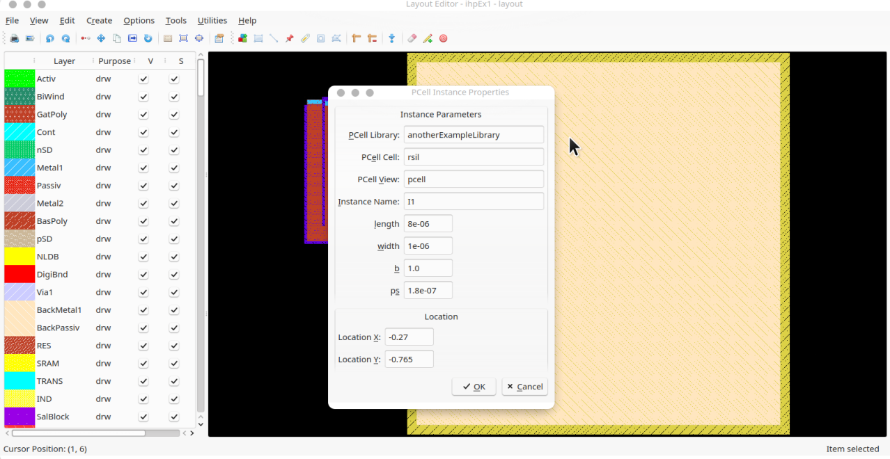

## GDS Export

GDS is standard output format for the integrated circuit foundries. Revolution EDA can export hierarchical binary GDS files. To export a GDS file of the layout, select `Tools->Export GDS` menu item. The dialogue will ask you the database unit, precision and export file location in the file system. The database unit and precision fields are prefilled with the values from `process.py` file. GDS export is handled by excellent `gdstk` package.

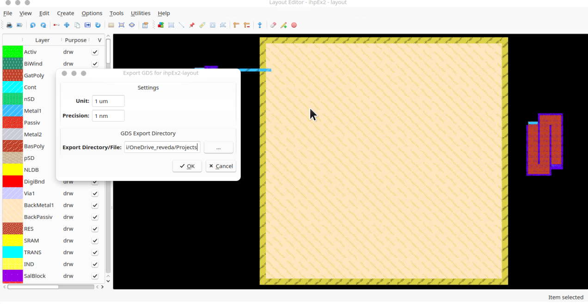

The resulting GDS file can be viewed and further processed for DRC/LVS by kLayout. Currently, GDS exports can only be hierarchical.

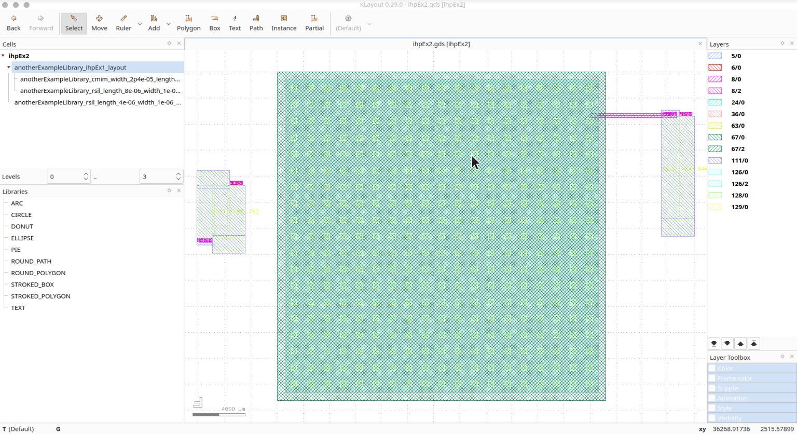


