# Revolution EDA Symbol Editor
Symbol Editor is where the schematic representation of a basic circuit component, such as an
inductor, capacitor or even an entire circuit can be created to be later used in the schematic
editor.

Revolution EDA symbol editor is geared towards representation of integrated circuit components
with complex geometry dependent parameters. Symbol editor has basic drawing functionality for

1. Lines
2. Circles
3. Arcs
4. Rectangles
5. Polygons

Edits can be undone or redone using `Undo` or `Redo` toolbar buttons, or `U` or `Shift-U` keys.

## Lines

Lines are drawn by pointing-and-pressing left mouse button at the start and releasing at the end
point of the line. Lines can be horizontal or vertical. A drawn line can be edited either by
selecting it and pressing `q` key

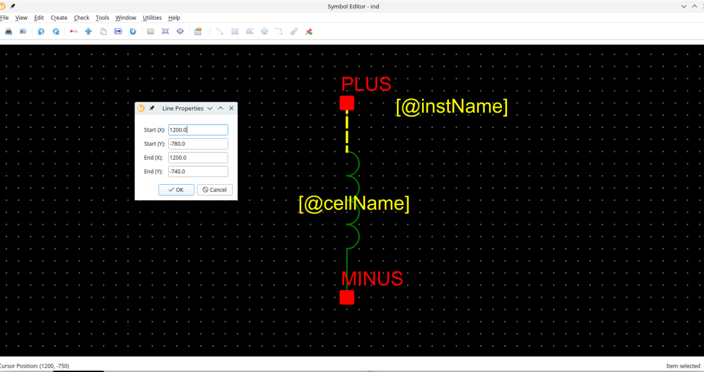

or by selecting `stretch` mode (`m`-key or selecting `stretch` option at the right-mouse button
click). Then, select either end of the line, the line will turn red and selected line end will
be indicated by a circle.

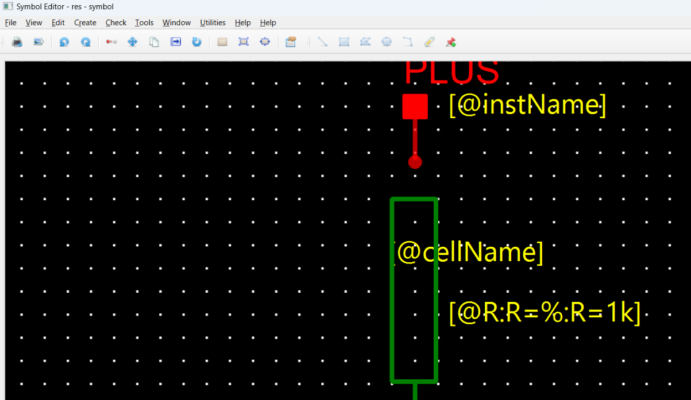

## Circles

Circles are drawn by selecting a centre point, pressing left-mouse button at that point and
releasing left-mouse button. It can be also edited similarly to a line either by displaying the
properties dialogue (select the circle and press `q` key or select the `Properties` option in
the contextual menu),

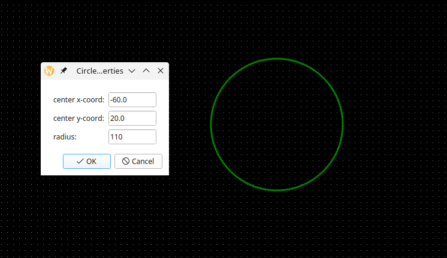

or by pressing `m` key or selecting `stretch` option. The circle will turn red and a hand shape
will denote that stretch mode is activated. Just move the hand-cursor so that the circle is the
right size.

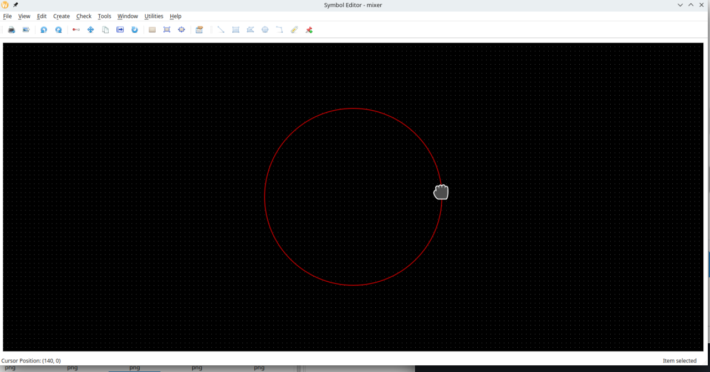

Beyond drawing a the symbol outline, the symbol editor can also indicate pins, where the element
or the circuit is connected to the other elements or circuits.

## Rectangles

Rectangles are similarly created by pressing mouse button at one corner and then releasing it at
the other diagonal corner.

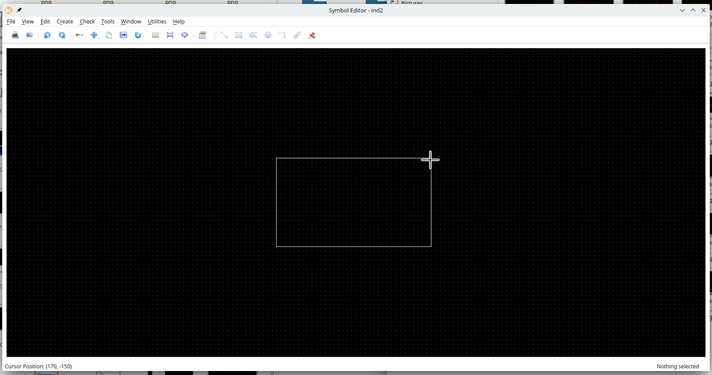

Rectangles can be similarly edited using properties dialogues or stretching any side by
selecting that side after pressing `m` key or selecting `stretch` option in the contextual menu.

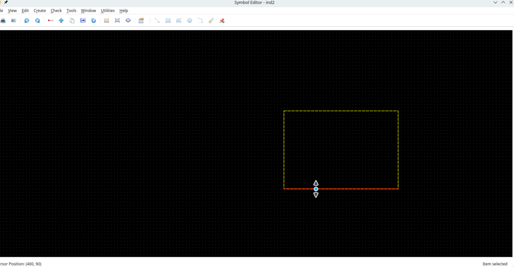

## Arcs

Arc drawing is performed similarly to a rectangle drawing. Depending on the angle of diagonal
arc will be pointing any of the four directions:

| Diagonal Angle       | Arc Direction |
| -------------------- | ------------- |
| 90 > $\theta$ > 0    | Up            |
| 180 > $\theta$ > 90  | Left          |
| 270 > $\theta$ > 180 | Down          |
| 360 > $\theta$ > 270 | Right         |

Similarly to other shapes, arcs can be also be edited using property dialogue or by stretching.
One caveat in stretching is that if the bounding rectangle of a stretched arc is flipped, it
will be saved correctly in the cellview file. This is a known bug.

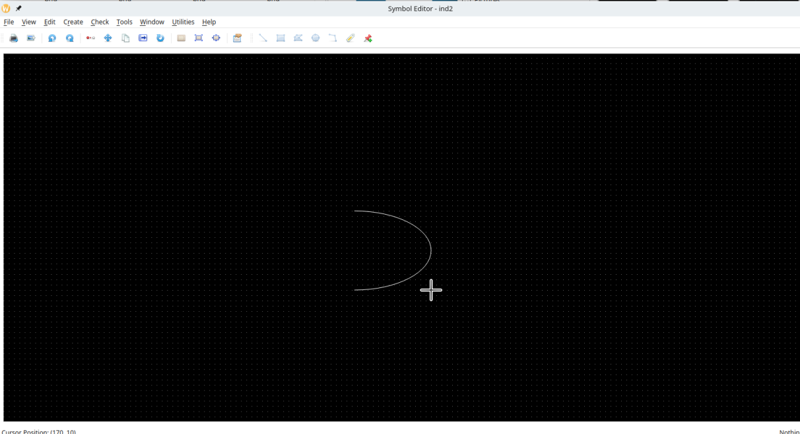

## Polygons

Polygons are created by selecting `Create->Create Polygon…` menu item or pressing `Create Polygon` item from the
toolbar. To start the polygon, click on the right mouse button for the first point. A guide line will be shown between
that point and the present cursor location. Now press the right mouse button again to select the second point of the
polygon. A line will be created between the first and second point, while the guideline between these points will be
erased. Instead, there will be another guide line between the second point and the cursor position. Once again pressing
right mouse button will create another line between second and third points. Moreover a triangle consisting of first,
second and third points will be drawn. If the user double clicks right mouse button at this point, the polygon create
action will be stopped. Alternatively, the user can press `Esc` button on the keyboard. On the other hand, if the user
now clicks another point on the editor, a *quadrilateral* will be created. Similarly adding another point will yield a
pentagram and so on.

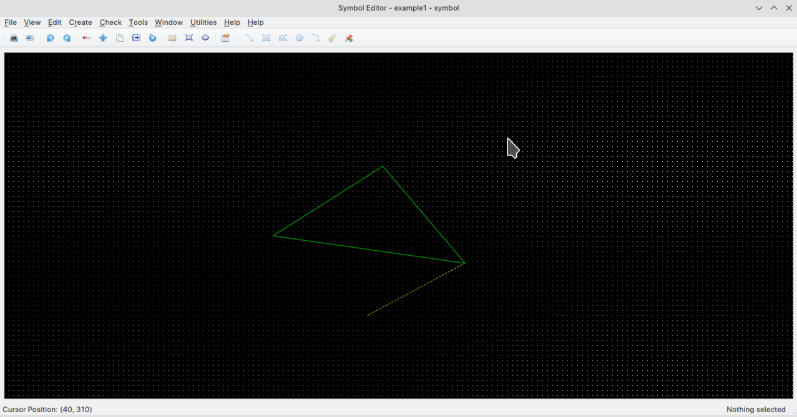

A polygon can be edited in a few different ways. The easiest is to select the polygon and press `S` key to stretch the polygon. Now press on one of the corners of the polygon, if the corner is selected, a blue circle will be placed at that corner. Now move your cursor while pressing right mouse button and release it when you polygon corner is where you want it to be:

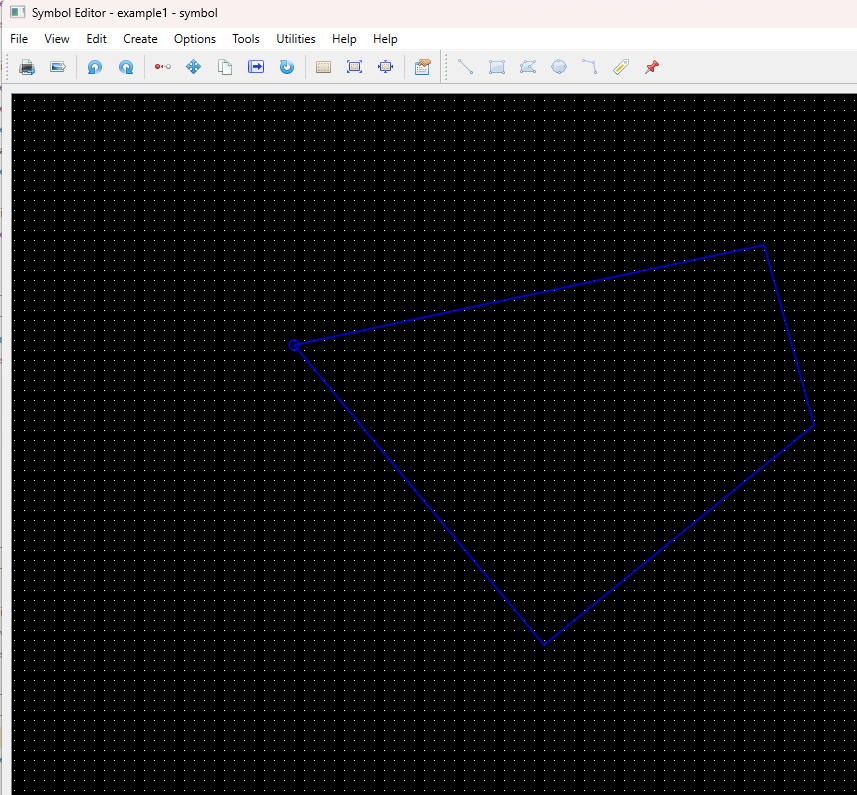

Polygons can be also be edited using a dialogue. Select the polygon and bring up the `Symbol Polygon Properties` dialogue. All the points will be listed with their x and y coordinates. The designer can delete any point selecting the checkbox on the first column or edit that point. Alternatively, a new point can be edited using the last empty row. When that row is edited, a new row is created for further point entry. There can be up to 999 points in a polygon.

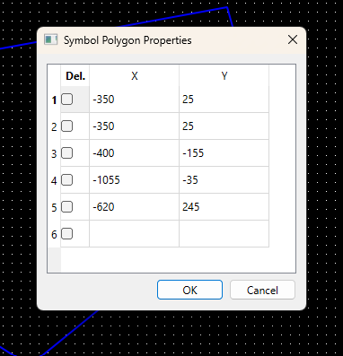

## Pins

Pins denote the connection of the element or circuit defined by symbol to the external circuits.
Pins can be created by clicking toolbar icon or selecting `create Pin…` menu item under `Create`
menu. Note that pin direction and pin type information is not saved or used for the symbol cell
views at the moment.

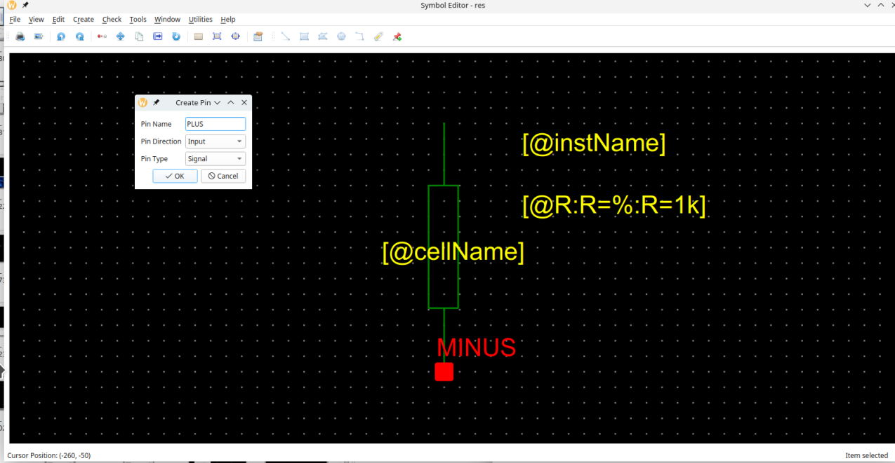

## Labels

Labels carry all the relevant information for an instance of a cellview. Thus the labels may
different values (texts) for each instance.

There are three types of labels:

1. **Normal**: These type of labels is just adding some notes on the text. They are not used in
   netlisting.

2. **NLPLabel**: These types of labels are evaluated using simple rules. Their format is:

   `[@propertyName:propertyName=%:propertyName=defaultValue]`

   The parts of the NLPLabel is separated by columns(:). Note that
   only **@propertyName** part is mandatory. The second and third parts
   do not need to exist in all NLPLabels.

   If only first part exists, there are a limited number of *predefined* labels that can be
   used.
   These are:

   | Label Name     | Label Definition | Explanation                                       |
   | -------------- | ---------------- | ------------------------------------------------- |
   | cell name      | `[@cellName]`    | Cell Name, e.g. nand2, nmos, etc                  |
   | instance name  | `[@instName]`    | Instance name for netlisting, e.g. I1, I15, etc.  |
   | library Name   | `[@libName]`     | Library Name for the symbol                       |
   | view Name      | `[@viewName]`    | View Name, normally includes *symbol* in the name |
   | element Number | `[@elementNum]`  | Element Number, forms a part of Instance Name     |
   | model Name     | `[@modelName]`   | Model name for the element in the netlist         |

   Model name label `[@modelName]` defaults to `modelName` entry in symbol attributes. If the third part exists, the label text is determined by whether a label value is entered for the instance. If the label value is entered, then the second part is used to display the label, if not the third part is shown and used.

   NLP labels can be referred by their the first part of the label definition. For example, if the label definition
   is `[@w:w=%:w=1u]`, then the label can be referred in the symbol attributes as `@w`.

3. **Python Label** : Python labels allow the label values to be determined depending on the
   values of other labels or any other values defined in the process design kit (PDK). The
   ==relevant functions that can be used in the Python labels are defined in `PDK/callbacks.py`
   file==. Each symbol should have a class defined in `callbacks.py` file. A few sample
   definitions are shown in the included `PDK/callbacks.py` file:

   ```python
   class baseInst:
       def __init__(self, labels_dict: dict):
           self._labelsDict = labels_dict
   
   
   class res(baseInst):
       def __init__(self, labels_dict: dict):
           super().__init__(labels_dict)
   
       def doubleR(self):
           Rvalue = self._labelsDict.get("R").labelValue
           if Rvalue.isalnum():
               return str(2 * Quantity(Rvalue))
           return "?"
   
   
   class nmos(baseInst):
       def __init__(self, labels_dict: dict):
           super().__init__(labels_dict)
           self.w = Quantity(self._labelsDict["@w"].labelValue)
           self.l = Quantity(self._labelsDict["@l"].labelValue)
           self.nf = Quantity(self._labelsDict["@nf"].labelValue)
           self.sd1p8v = 0.28
           self.sa1p8v = sb1p8v = 0.265
           self.sourceDiffs = lambda nf: int(int(nf) / 2 + 1)
   
       def asparm(self):
           return self.sourceDiffs(self.nf) * (self.w / self.nf) * self.sd1p8v
   ```

   For example, an `nmos` symbol has a `asparm()` function defined. We can use it to define the value of a label
   for `nmos` symbol. When this symbol is instantiated in a schematic, the value of `as` label will determined
   by `asparm()` function defined in the `callbacks.py` file. This means that instance callbacks can now use the all the
   facilities of Python, even conceivably ==machine learning== libraries to optimise designs.

   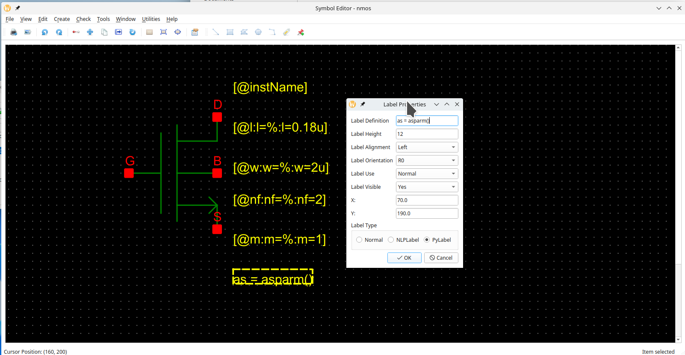

   Labels can be also be hidden to reduce the clutter in the schematic instance of a symbol.
   Hidden labels are as valid as visible labels. Label properties dialogue also
   have `labelAlignment`, `labelOrientation` and `labelUse` fields, which are currently not
   implemented. However, labels can be rotated using context menu’s `rotate` option.

## Attributes

Attributes are properties that are common to all instances of a symbol. They could denote for example, how a particular
symbol would be netlisted in Xyce circuit simulator netlist using `XyceSymbolNetlistLine` attribute. *NLPDeviceFormat*
expressions was originally created for Glade by Peardrop Design Systems. It consists of string constants and NLP
Expressions.

Some of the important attributes for a symbol are summarized below:

| Attribute Name          | Attribute Use                                           | Example                                                      |
| ----------------------- | ------------------------------------------------------- | ------------------------------------------------------------ |
| XyceSymbolNetlistLine   | Symbol cellview  used in netlisting                     | `M@instName @pinList %modelName w=@w l=@l nf=@nf  as=@as m=@m` |
| XyceVerilogaNetlistLine | Veriloga cellview used in netlisting                    | `Yres @instName @pinList  resModel @R`                       |
| XyceSpiceNetlistLine    | Spice cellview used in netlisting                       | `X@instName @pinList newckt`                                 |
| vaModelLine             | Used as a model line for Veriloga netlisting            | `.MODEL resModel res R = 1`                                  |
| vaHDLLine               | Used to by Revolution EDA to create linkable modules    | *`.HDL /home/user/exampleLibraries/analogLib/resVa/res.va`   |
| pinOrder                | To sync pin order between netlists of various cellviews | `PLUS, MINUS`                                                |
| incLine                 | To include imported Spice subcircuit                    | `.INC /home/user/exampleLibraries/anotherLibrary/example1/newckt.sp` |

Note that the labels are referred by their names prefixed by `@` in the attributes of a symbol. If a symbol attribute
should be referred in another symbol attribute, it should be prefixed by `%`, see the example
for `XyceSymbolNetlistLine` in the table above where `modelName` attribute is referred as `%modelName`.  `pinOrder`
attribute is important to synchronise the various formats for netlisting. It should list all symbol pins separated by
commas in the order required for the netlisting. This string will replace `@pinList` string in the attributes.

Attributes are defined in the `Cellview properties` dialogue that can be accessed under `Edit` menu:

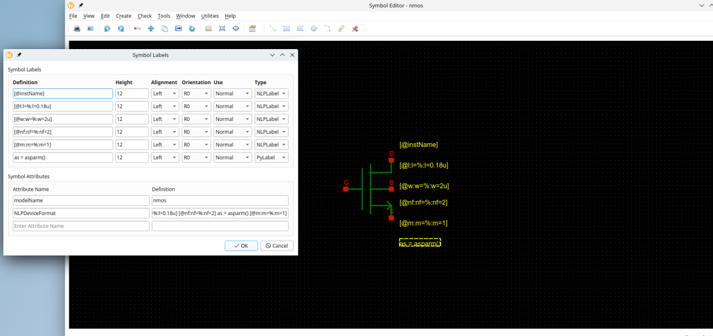

This dialogue has two parts. The first part summarises the already defined labels. Label properties can be changed also
here.
However labels can be deleted or added here. The second part is the `Symbol attributes` part. In this dialogue, any
number of symbol attributes can be defined. These attributes will not be shown but can also be inspected but not edited
in the schematic view.

Depending on how symbol is created not all the attributes needed to use various cellviews for netlisting are not
available on the same symbol. For example, a designer creates a symbol from the schematic, but there is also a Verilog-a
view for that cell. In that case, the symbol will have `XyceSymbolNetlistLine` needed for the use of the Symbol View in
the netlisting but not the attributes to have veriloga cellview to be used in the netlisting. In that case, the user
should add those attributes manually in the symbol editor window.

### Required attributes for netlisting

#### Symbol

If a *symbol* cellview is to be used in the netlisting, these are the minimum attributes that should be defined for that
symbol.

| Attribute Name        | Example                                                      |
| --------------------- | ------------------------------------------------------------ |
| XyceSymbolNetlistLine | `M@instName @pinList %modelName w=@w l=@l nf=@nf  as=@as m=@m` |
| pinOrder              | `D, G, B, S`                                                 |

Note that another attribute `modelName` needs to be defined for the example in the table.

#### Veriloga

If the veriloga cellview is to be used in the circuit netlisting, these attributes should be added to symbol. Note that
if the veriloga file is imported and used to create a symbol, they will be automatically added to the symbol.

| Attribute Name          | Example                                                    |
| ----------------------- | ---------------------------------------------------------- |
| XyceVerilogaNetlistLine | `Yres @instName @pinList  resModel @R`                     |
| vaModelLine             | `.MODEL resModel res R = 1`                                |
| vaHDLLine               | *`.HDL /home/user/exampleLibraries/analogLib/resVa/res.va` |
| pinOrder                | a, b, c                                                    |

#### Spice

Spice subcircuits can be used in the netlists when the symbol has the proper attributes. The required attributes for the
netlist inclusion of a SPICE subcircuit are summarised in the table below:

| Attribute Name       | Example                                                      |
| -------------------- | ------------------------------------------------------------ |
| XyceSpiceNetlistLine | `X@instName @pinList newckt`                                 |
| incLine              | `.INC /home/user/exampleLibraries/anotherLibrary/example1/newckt.sp` |
| pinOrder             | PLUS, MINUS                                                  |

## Other Editing functions

Any item on the symbol editor can be ==rotated, moved or copied== using by selecting menu item or by clicking on the
relevant button on the toolbar as well as using context menu.

The cursor position is displayed at left-bottom corner of the editor. If the user wants to move
the origin point of the symbol editor, it can use `Move Origin` menu item under `Edit` menu.
Once it is selected, click at the new origin point. Hereafter, all the editing functions will
refer to the new origin point.

