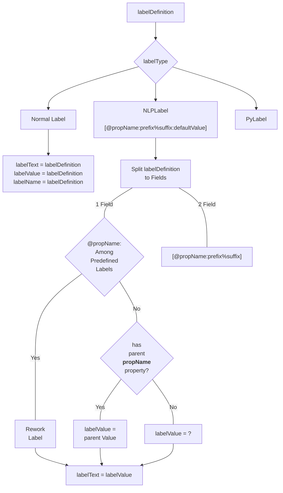

# Symbol and Schematic Labels

## Symbol Labels

There are three types of labels:

1. **Normal**: These type of labels is just adding some notes on the text.
   They are not used in netlisting.

2. **NLPLabel**: These types of labels are evaluated using simple rules.
   Their format is:

   `[@propertyName:propertyName=%:propertyName=defaultValue]`

   The parts of the NLPLabel is separated by columns(:). Note that
   only **@propertyName** part is mandatory. The second and third parts
   do not need to exist in all NLPLabels.

   If only first part exists, there are a limited number of *predefined* labels that can be
   used.
   These are:

   | Label Name     | Label Definition | Explanation                                       |
         | -------------- | ---------------- | ------------------------------------------------- |
   | cell name      | `[@cellName]`    | Cell Name, e.g. nand2, nmos, etc                  |
   | instance name  | `[@instName]`    | Instance name for netlisting, e.g. I1, I15, etc.  |
   | library Name   | `[@libName]`     | Library Name for the symbol                       |
   | view Name      | `[@viewName]`    | View Name, normally includes *symbol* in the name |
   | element Number | `[@elementNum]`  | Element Number, forms a part of Instance Name     |
   | model Name     | `[@modelName]`   | Model name for the element in the netlist         |

   Model name label `[@modelName]` defaults to `modelName` entry in symbol attributes.

   If the second part exists, the label text is determined by whether label Value is set up for
   the instance. If the label value is entered, then the label text becomes `propertyName =
   labelValue`. If the label value is not yet known, the label text becomes `propertyName = ?`.

   If also a third part exists, the label text becomes `propertyName = defaultValue` is the
   label is not set. If it is set, then the label text is `propertyName = labelValue`.

3. **PyLabel**: These type labels can *ideally* use any function defined in Python. However,
   they are able to use the methods defined for the parent item of the label in our
   implementation. There is no need for `.` (dot) notation when inputting the method name.
   Revolution EDA will automatically handle it.

## Flowchart for Label Evaluation

